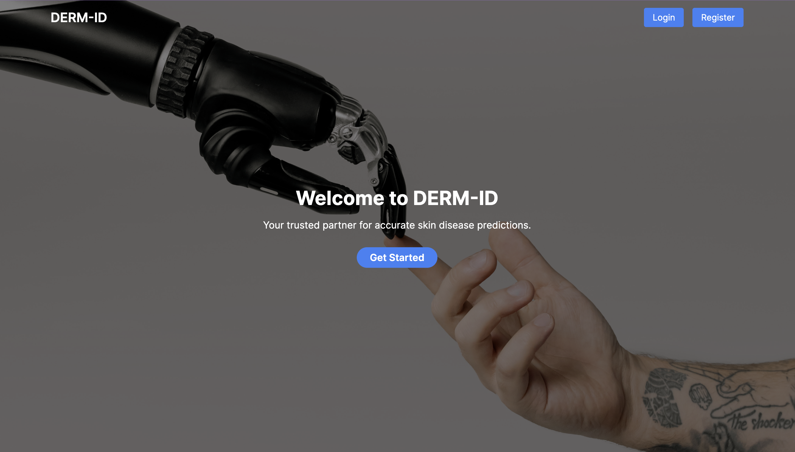

# DERM-ID: Dermatology Image Recognition and Diagnosis Tool

This web application harnesses the power of machine learning. Users can register or log in, upload a skin image, and receive instant, accurate skin disease predictions and diagnosis. Using state-of-the-art technology trained on verified data, DERM-ID simplifies skin health assessment.

## Features
<h4>Accessible Preliminary Diagnosis:</h4> user-friendly web and mobile application that is easily accessible even with limited connectivity.<br>
<h4>Streamlined User Experience:</h4> Authentication-based streamlined process that ensures quick and efficient preliminary diagnosis.<br>
<h4>Machine Learning at the Core:</h4> Advanced machine learning algorithms are used to accurately recognize and diagnose dermatological conditions.<br> 
<h4>Image Processing Expertise:</h4> leveraging state-of-the-art image processing techniques to extract essential information from uploaded images, aiding in the diagnostic process.<br>
<h4>Chatbot Support:</h4> Our app has a built-in Chatbot system based on Generative AI that can resolve quick queries and frequently asked questions of the users.<br>


## Ouput

<br>


This is a [Next.js](https://nextjs.org/) project bootstrapped with [`create-next-app`](https://github.com/vercel/next.js/tree/canary/packages/create-next-app).

## Getting Started

First, run the development server:

```bash
npm run dev
# or
yarn dev
# or
pnpm dev
```

Open [http://localhost:3000](http://localhost:3000) with your browser to see the result.

You can start editing the page by modifying `app/page.js`. The page auto-updates as you edit the file.

This project uses [`next/font`](https://nextjs.org/docs/basic-features/font-optimization) to automatically optimize and load Inter, a custom Google Font.

## Learn More

To learn more about Next.js, take a look at the following resources:

- [Next.js Documentation](https://nextjs.org/docs) - learn about Next.js features and API.
- [Learn Next.js](https://nextjs.org/learn) - an interactive Next.js tutorial.

You can check out [the Next.js GitHub repository](https://github.com/vercel/next.js/) - your feedback and contributions are welcome!

## Deploy on Vercel

The easiest way to deploy your Next.js app is to use the [Vercel Platform](https://vercel.com/new?utm_medium=default-template&filter=next.js&utm_source=create-next-app&utm_campaign=create-next-app-readme) from the creators of Next.js.

Check out our [Next.js deployment documentation](https://nextjs.org/docs/deployment) for more details.
